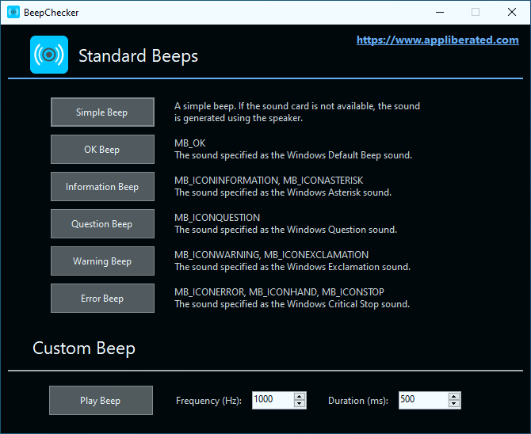

# BeepChecker

BeepChecker is a tiny portable Windows program that plays the standard Windows beep sounds: the Information, Question, Warning, or Error sounds. It also lets you play custom beeps by generating simple tones on the speaker.

Use BeepChecker to familiarize yourself with the sound of the different standard Windows beeps, and learn to differentiate between them. Check the system sounds configuration on your PC, or check system sounds across Windows versions and virtual machines. Hardware enthusiast? Test if the beep sounds are generated by the internal PC speaker or by the sound card.

BeepChecker is very easy to use: you can simply download the tiny executable file and run it directly, without installation. The tidy user interface has a Play button and a description label for each type of beep, and frequency and duration input boxes for generating the custom beep.

## Screenshot

## Quotes

> "BeepChecker can help you learn the sounds of your OS, so you know what it is trying to tell you the next time it emits a beep. ... An efficient and easy to use application." (**Softpedia Five Star Review**)

> "A handy and effective yet simple tool, especially for those of us who never knew what all the different beeps meant. ... All in all a very neat tool." (**Rocky Bytes Score: Very Good**)

> "BeepChecker can come in handy when you want to familiarize yourself with what the system is trying to tell you, using the sounds. ... All in all, a simple decent freeware." (**I Love Free Software**)

[More Reviews](https://techaurelian.com/beepchecker/reviews/)

## Download

The latest stable version of BeepChecker can be downloaded from [GitHub Releases](https://github.com/TechAurelian/BeepChecker/releases). You can download the Installation package, or a fully portable edition that does not require installation. BeepChecker runs on Windows 10, 8, 7, Vista, and XP.

## Source Code

BeepChecker is written in C# using Windows Forms and .NET Framework 2.0. The project is developed using Visual Studio Community 2019, with the help of [StyleCop.Analyzers](https://github.com/DotNetAnalyzers/StyleCopAnalyzers).

## Contributions

All contributions are welcome: use-cases, documentation, design, graphics, icons, code, patches, bug reports, feature requests, suggestions, etc. You do not need to be a programmer to speak up! Also, if you like BeepChecker, give it a star here on GitHub! ⭐️

## License

BeepChecker is licensed under the [MIT License](LICENSE).
